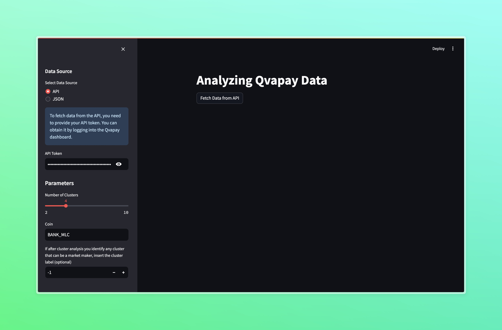
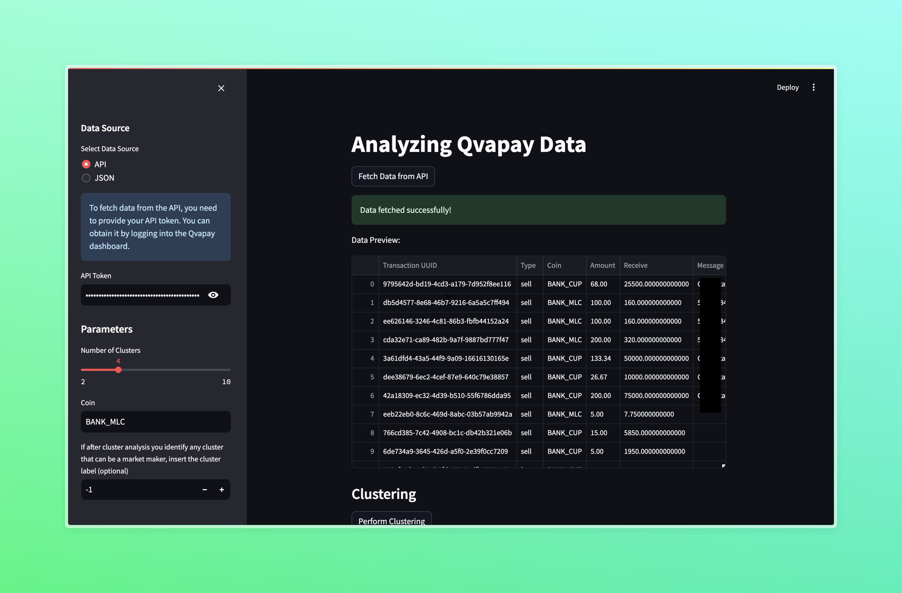
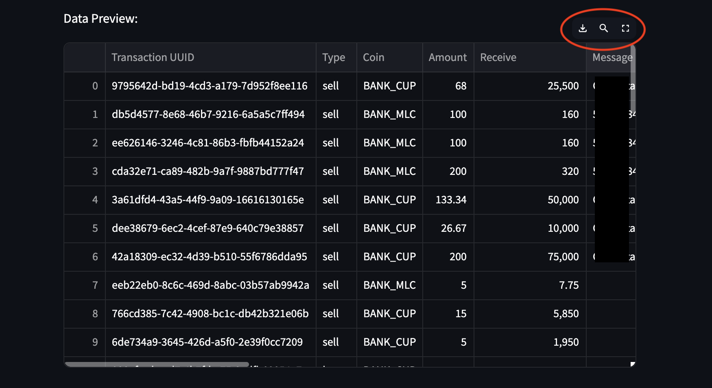
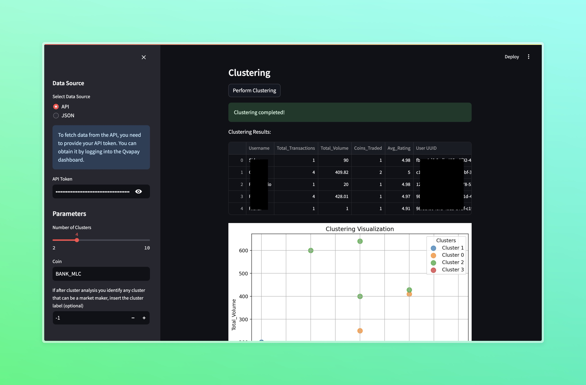
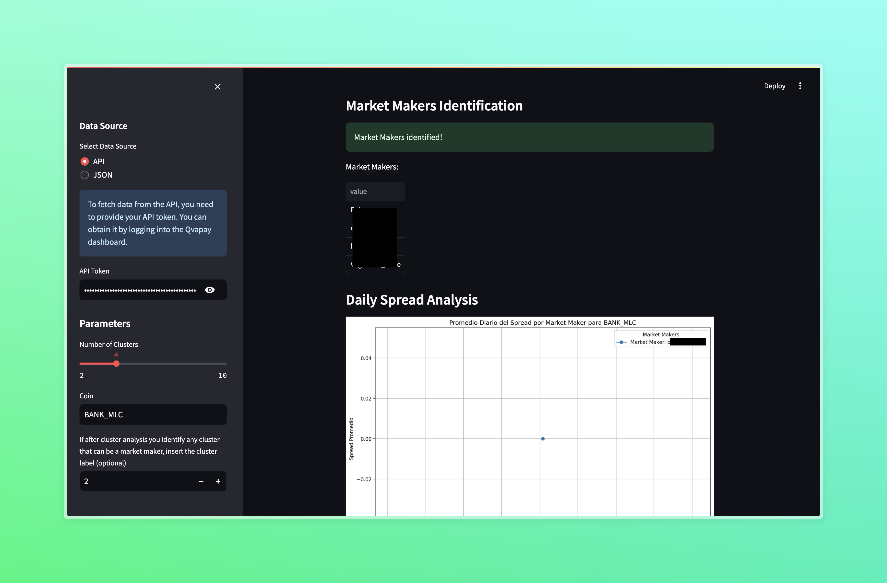
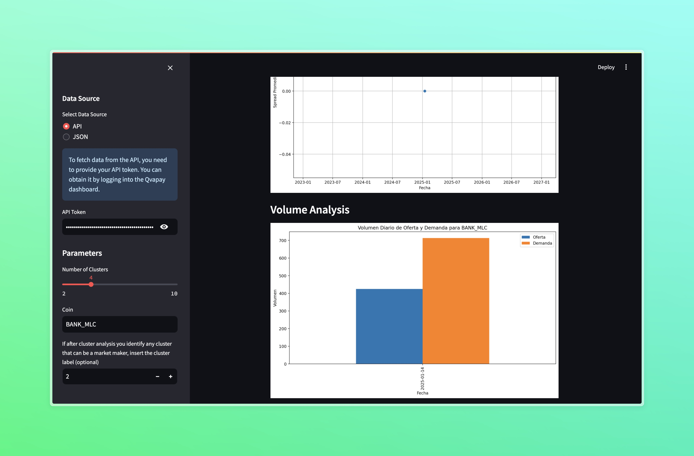

# Qvapay Data Analysis

Este repositorio contiene una solución al reto propuesto en [Datalis Qvapay Challenge](https://github.com/Datalis/qvpay-challenge).

## Requisitos

Asegúrate de tener las siguientes herramientas instaladas antes de ejecutar el proyecto:

- Python 3.8 o superior
- Ejecutar `pip install -r requirements.txt` para instalar dependencias

## Instalación

1. Clona este repositorio:
   ```bash
   git clone https://github.com/sheyls/qvpay-challenge
   cd qvapay-analysis
   ```

2. (Si es necesario haz checkout a la rama con mi nombre de usuario `sheyls`):
   ```bash
   git checkout sheyls
   ```

## Ejecución de la solución

1. Asegúrate de tener un token de API válido de Qvapay. Esto es necesario para obtener los datos desde la API.

2. Ejecuta la aplicación de Streamlit para interactuar con los datos:
   ```bash
   streamlit run app.py
   ```

3. Una vez que la aplicación se cargue en tu navegador, selecciona el origen de los datos (API o JSON) y configura los parámetros desde la barra lateral.

4. Sigue las instrucciones en la interfaz para:
   - Cargar datos desde la API o un archivo JSON.
   - Realizar el análisis de clustering.
   - Identificar market makers.
   - Analizar el spread diario y el volumen de oferta y demanda.

## Identificación de Market Makers

Se tuvo la idea de realizar un algoritmo de clustering para identificar comportamientos de usuarios similares, bajo la premisa de que los market makers deben tener un comportamiento similar en la plataforma. Los datos se agrupan utilizando el algoritmo de clustering K-means.

Se realizó un análisis previo que determinó que 4 era el número óptimo de clusters según el método del codo. Sin embargo, dado que se quería una herramienta interactiva, se decidió que se pudiera explorar con diferentes números de clusters.

El clustering no es en sí una herramienta para predicción, sino para exploración. Por lo tanto, la implementación de clustering no garantiza la identificación inmediata de market makers, pero sí permite dividir los datos en clusters, lo cual, con análisis experto, podría identificar patrones de comportamiento característicos de market makers.

Para identificar los market makers se puede:
   - Introducir el número de cluster observado en el proceso de exploración que mejor se acomode a ellos.
   - Dejar que el sistema seleccione por defecto el cluster con el mayor valor promedio en las métricas `Total_Transactions` y `Total_Volume`.

1. Los usuarios dentro del cluster identificado se consideran market makers, y sus transacciones se analizan en detalle.

## Cálculo del Spread Diario

1. Se filtran las transacciones de los market makers para una moneda específica.
2. Se agrupan las transacciones por fecha y tipo (`buy` y `sell`), calculando el precio promedio para cada día.
3. El spread diario se calcula como la diferencia entre el precio promedio de venta y el precio promedio de compra para cada día.
4. Los resultados se representan gráficamente utilizando `matplotlib` y un gráfico de líneas, ideal para explorar tendencias temporales.

**Nota:** Es importante saber que los datos proporcionados por la API son limitados, por lo que es posible que el gráfico no esté completamente poblado.

## Análisis del Volumen Diario de Oferta y Demanda

1. Las transacciones para una moneda específica se agrupan por fecha y tipo (`buy` y `sell`).
2. Se calcula el volumen total de oferta y demanda para cada día.
3. Los datos se representan gráficamente en un gráfico de barras comparativo, permitiendo visualmente identificar si la demanda supera considerablemente la oferta.

## Análisis Adicional

Se implementó una aplicación en Streamlit para facilitar el trabajo y la exploración de los datos.

- Es posible introducir un token para conectar con la API.

<p align="center">
  
</p>

- Se pueden cargar datos desde un archivo JSON con el formato devuelto por la API o realizar una consulta directa a la API.

- Los datos se organizan en una tabla interactiva que permite:
  - Aumentar el tamaño para visualización completa.
  - Filtrar columnas por palabras clave.
  - Ordenar columnas.
  - Exportar datos en formato CSV.

<p align="center">
  
</p>

<p align="center">
  
</p>

- El clustering permite experimentar con varios valores de K (número de clusters) y visualizar los resultados con gráficos de dispersión, buenos para identificar grupos categóricos según los ejes seleccionados.
- 
<p align="center">
  
</p>

- La identificación de market makers se realiza en base al cluster identificado en la barra lateral o mediante una heurística automática.

<p align="center">
  
</p>

- Se visualizan los usuarios identificados y sus transacciones en el gráfico de spread.

- Se puede comparar la oferta y demanda diaria con un gráfico de barras.

<p align="center">
  
</p>


## Estructura del Proyecto

- **app.py**: Interfaz principal de Streamlit.
- **clustering.py**: Funciones relacionadas con el preprocesamiento de datos, clustering y visualización.
- **main.py**: Funciones principales para la obtención y análisis de datos.
- **utils.py**: Configuración de API y utilidades auxiliares.
